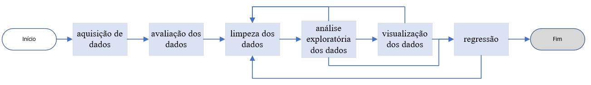
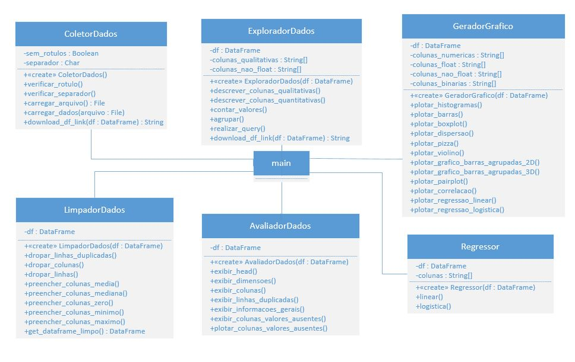

# Analisador de Dados

Autor: Leonardo Simões

Trabalho de conclusão de curso (TCC) em Engenharia de Computação pela UERJ. 

Aplicativo Web para análise de dados de forma interativa e semiautomatizada, de 
modo que, facilite o processo e possa ser realizada por uma pessoa sem conhecimentos em programação, 
e sem necessidade de instalar algum software.

## Ambiente de programação

A aplicação foi construída usando a linguagem Python 3.6 e seus módulos:

* streamlit: 0.71.0
* numpy: 1.19.4
* pandas: 1.1.4
* matplotlib: 3.3.2
* seaborn: 0.11.0
* scikit-learn: 0.23.2

## Execução 

Para acessar a aplicação hospedada no heroku (link temporário): https://analisador-dados.herokuapp.com/

Para executar a aplicação localmente: após baixa-lá, configurar a venv (ambiente virtual) e instalar as dependências, 
use o terminal no diretório da aplicação e use o comando "streamlit run main.py". 

## Fluxo

O fluxo de análise de dados adotada neste trabalho foi definido pelas etapas de aquisição de dados, avaliação dos dados, 
limpeza dos dados, análise exploratória dos dados, visualização dos dados e regressão. 
Este fluxo geralmente é linear, mas para as etapas após a de limpeza, pode haver um retorno para uma das etapas anteriores até a de limpeza.

## Diagrama de Classes

